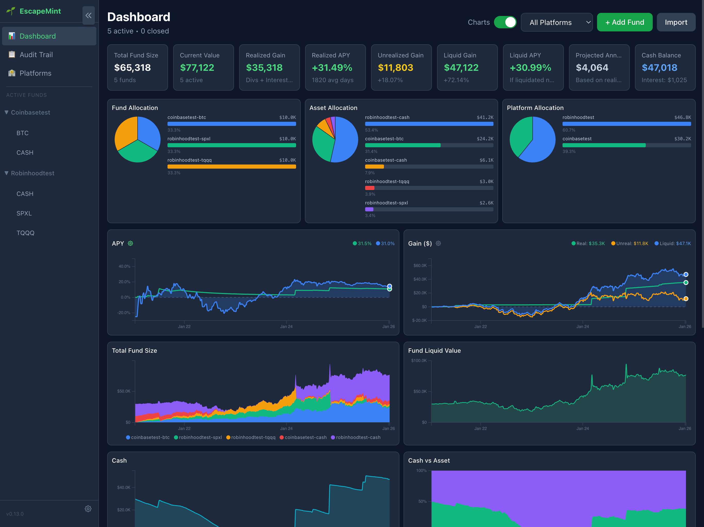
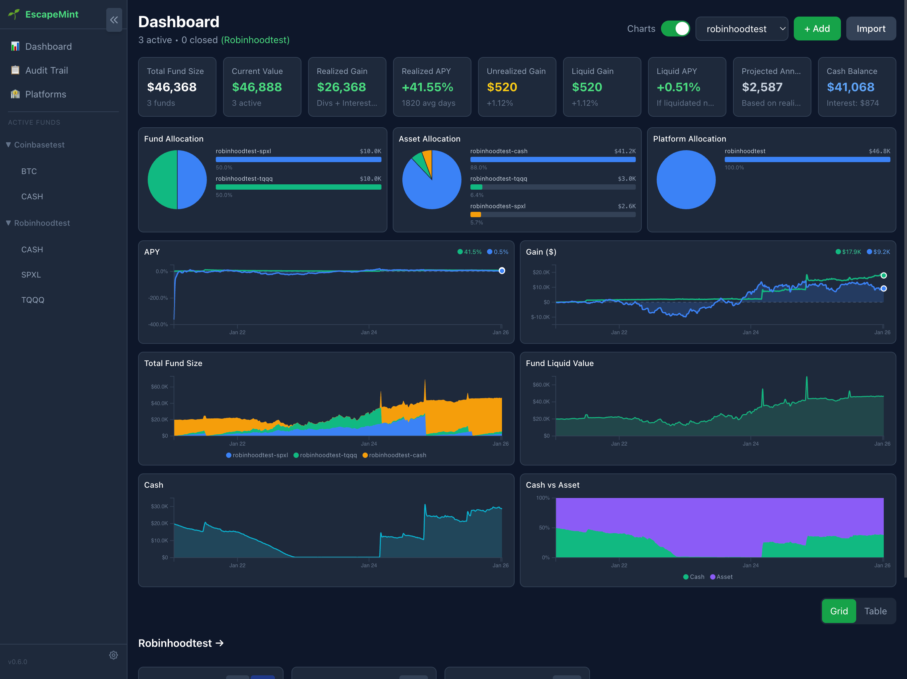
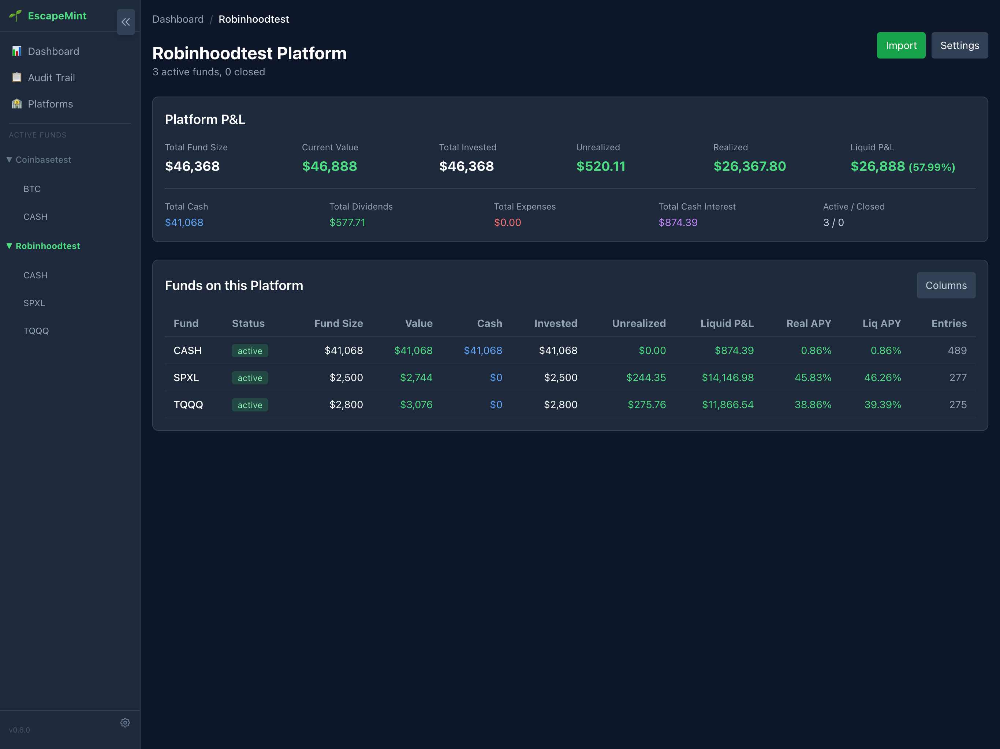
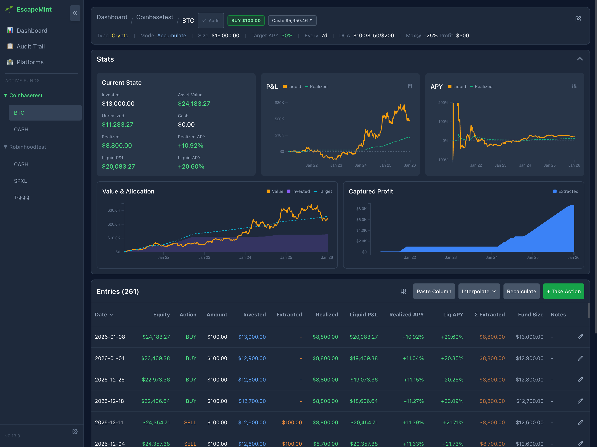
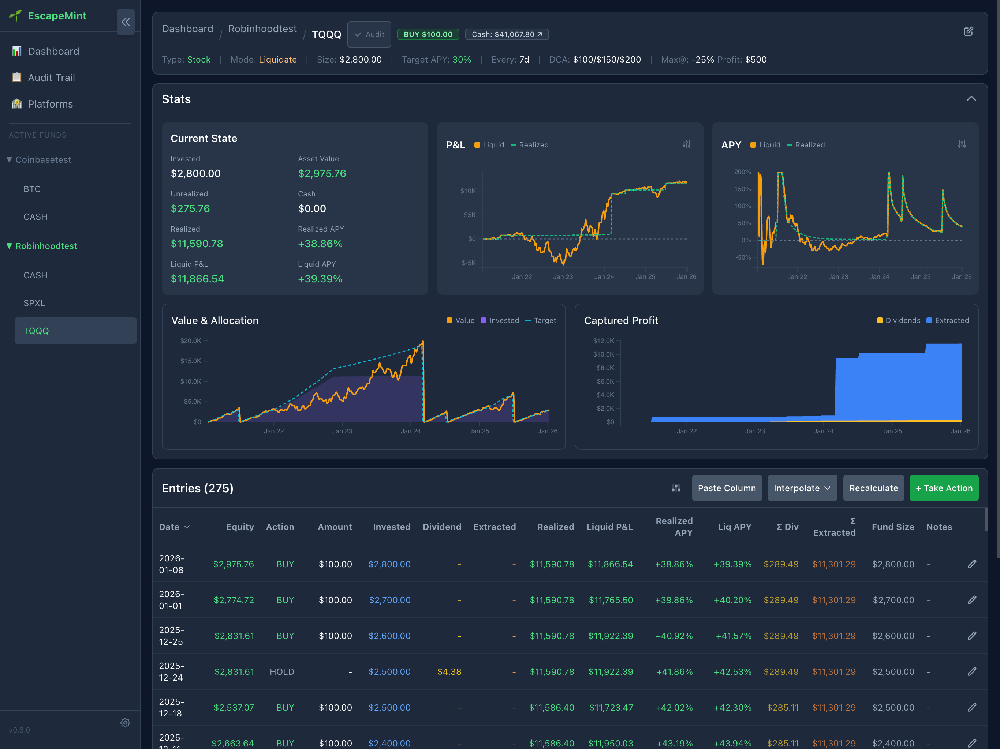
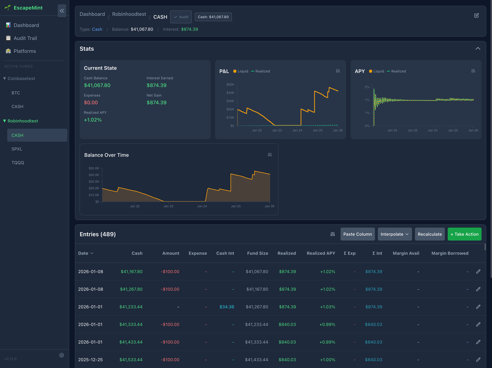

# EscapeMint

A local-first, open-source capital allocation engine for rules-based fund management.

> **Disclaimer**: This software is provided "as is" without warranty of any kind. Use at your own risk. While I use this tool to manage my own investments, you should thoroughly review and test the code for your own needs. This is not financial advice, and the authors are not responsible for any financial losses that may result from using this software.

## Overview

EscapeMint helps you manage investments across multiple accounts (Robinhood, Coinbase, M1, etc.) using deterministic, rules-based DCA (Dollar Cost Averaging) logic. It advises buy/sell actions based on your target growth expectations, automatically adjusting DCA amounts based on asset performance.



## Features

- **Multi-Account Support**: Track multiple sub-funds with individual configurations
- **Tiered DCA**: Automatically buy more when assets are down, less when on-target
- **Accumulate Mode**: Choose to reinvest profits or liquidate when above target
- **Cash Interest Tracking**: Track interest earned on idle cash
- **Transparent & Auditable**: All data stored as plain TSV files you can inspect
- **Local-First**: Runs entirely on your machine, no cloud dependencies
- **No External Data**: Manual equity snapshots, no brokerage API required

## Supported Platforms

EscapeMint has specific fund type handling for the following brokerages:

| Platform | Fund Types | Features |
|----------|-----------|----------|
| **[Robinhood](https://join.robinhood.com/adame110/)** | Stock, Crypto | DCA, cash interest, margin tracking |
| **[M1 Finance](https://m1.finance/eFfGPAapZMyF)** | Stock | DCA, dividend reinvestment |
| **[Coinbase](https://advanced.coinbase.com/join/XWJ3U4F)** | Crypto, Derivatives | Spot trading, perpetual futures |
| **[Crypto.com](https://crypto.com/app/iwmcxzu8n5)** | Crypto | Spot trading |

*The referral links above support the project. You can also use EscapeMint with any brokerage - just create a custom platform name.*

## Quick Start

### Prerequisites

- Node.js 20+ ([download](https://nodejs.org/))
- pnpm ([install](https://pnpm.io/installation)) - `npm install -g pnpm`

### Installation

```bash
# Clone the repository
git clone https://github.com/atomantic/escapemint.git
cd escapemint

# Install dependencies
pnpm install

# Build packages
pnpm run build:packages

# Create data directory (the test data generator on the Settings page can populate sample data)
pnpm run setup:data

# Start the development servers
pnpm run dev
```

The app will be available at:
- **Frontend**: http://localhost:5550
- **API**: http://localhost:5551

Press `Ctrl+C` to exit the logs view. The servers will continue running in the background.

### PM2 Commands

The app uses PM2 for process management with automatic restart on file changes:

```bash
pnpm run dev          # Start both frontend and API servers
pnpm run dev:stop     # Stop all servers
pnpm run dev:restart  # Restart all servers
pnpm run dev:status   # Check server status
pnpm run dev:logs     # View logs (Ctrl+C to exit)
pnpm run stop         # Stop all servers
```

## How It Works

### The Fund Model

Each sub-fund tracks:
1. **Fund Size**: Total capital allocated (cash + invested)
2. **Cash Available**: Uninvested cash earning interest
3. **Start Input**: Total amount invested (sum of buys - sells)
4. **Actual Value**: Current market value of investments

### The DCA Strategy

EscapeMint uses a tiered DCA strategy based on performance:

| Performance | DCA Amount |
|-------------|------------|
| On-track or gaining | `input_min_usd` (smallest amount) |
| Below target | `input_mid_usd` (medium amount) |
| Significant loss (< `max_at_pct`) | `input_max_usd` (largest amount) |

When your investment is performing well above target (by `min_profit_usd`):
- **Accumulate mode (true)**: Sell the DCA amount to take profits
- **Accumulate mode (false)**: Liquidate entire position back to cash

### Example Workflow

```
Day 0:  Create fund "Robinhood:TQQQ" - $10,000 fund size
        Config: min=$100, mid=$150, max=$200, target=30% APY
        Cash: $10,000 | Invested: $0

Day 1:  Initial BUY $100
        Cash: $9,900 | Invested: $100 | Value: $100

Day 8:  Enter snapshot - TQQQ value is $95 (-5% loss)
        Since loss is small, use mid amount
        Recommendation: BUY $150

Day 8:  Execute BUY $149.99 (actual execution)
        Cash: $9,750 | Invested: $250 | Value: $245

Day 15: Enter snapshot - TQQQ value is $180 (-26% loss)
        Loss exceeds -25% threshold, use max amount
        Recommendation: BUY $200
```

## Configuration

Each sub-fund is configured with:

| Parameter | Description | Example |
|-----------|-------------|---------|
| `fund_size_usd` | Total capital in the fund | `10000` |
| `target_apy` | Target annual growth rate | `0.30` (30%) |
| `interval_days` | Days between actions | `7` (weekly) |
| `input_min_usd` | DCA when on-target | `100` |
| `input_mid_usd` | DCA when below target | `150` |
| `input_max_usd` | DCA when significant loss | `200` |
| `max_at_pct` | Loss threshold for max DCA | `-0.25` (-25%) |
| `min_profit_usd` | Profit threshold to sell | `100` |
| `cash_apy` | Interest on idle cash | `0.044` (4.4%) |
| `margin_apr` | Margin interest rate | `0.0725` (7.25%) |
| `accumulate` | Reinvest or liquidate profits | `true` |
| `start_date` | When tracking begins | `2024-01-01` |

## Project Structure

```
escapemint/
├── packages/
│   ├── engine/     # Pure calculation functions
│   ├── storage/    # TSV persistence layer (fund-store)
│   ├── server/     # Express API (port 5551)
│   └── web/        # React frontend (port 5550)
├── data/
│   └── funds/      # Your fund files (gitignored)
├── ecosystem.config.cjs  # PM2 configuration
└── package.json
```

## Scripts

```bash
pnpm install         # Install dependencies
pnpm run build       # Build all packages
pnpm run dev         # Start development servers (PM2)
pnpm run dev:stop    # Stop development servers
pnpm run test        # Run all tests
pnpm run test:e2e    # Run end-to-end tests
pnpm run lint        # Lint code
pnpm run typecheck   # Type check
```

## Data Storage

Each fund is stored as a single TSV file in `./data/funds/`:

```
data/
└── funds/
    ├── robinhood-tqqq.tsv
    ├── coinbase-btc.tsv
    └── m1-vti.tsv
```

Each file contains:
- **Line 1**: Config header (fund size, target APY, DCA amounts, etc.)
- **Line 2**: Column headers
- **Line 3+**: Time-series entries (date, value, action, amount, notes)

Example file:
```
#fund_size:10000	target_apy:0.30	interval_days:7	input_min:100	...
date	value	action	amount	dividend	expense	fund_size	notes
2024-01-01	100	BUY	100				Initial DCA
2024-01-08	205	BUY	100				Week 1 - TQQQ up
```

## Calculation Method

**Expected Target Value** uses periodic compounding on each purchase:

```
ExpectedGain = Σ(Trade_i × ((1 + APY)^(Days_i / 365) - 1))
ExpectedTarget = StartInput + ExpectedGain
```

**Actual Gain**:
```
GainUSD = ActualValue - StartInput
GainPct = (ActualValue / StartInput) - 1
```

**Target Difference** (determines if above/below target):
```
TargetDiff = ActualValue - ExpectedTarget
```

## Security & Privacy

- **Local-only**: No network calls except localhost
- **No telemetry**: Zero analytics or tracking
- **You own your data**: Plain-text TSV files, fully portable

## Backup & Restore

Your fund data is stored in plain TSV and JSON files in the `data/funds/` directory. To backup:

```bash
# Create a backup
cp -r data data.backup

# Or backup to a cloud-synced folder
cp -r data ~/iCloud/EscapeMint-backup
```

To restore:
```bash
# Stop the servers first
pnpm run dev:stop

# Restore from backup
rm -rf data
cp -r data.backup data

# Restart servers
pnpm run dev
```

## Screenshots

### Dashboard
The main dashboard shows all platforms with aggregate metrics, allocation charts, APY/gain tracking, fund size history, and cash vs asset breakdown.


### Dashboard - Platform Filter
Filter the dashboard to view metrics for a single platform with platform-specific allocation and performance charts.



### Platform View
View all funds within a platform with P&L summary, dividends, expenses, and detailed fund table.



### Fund - Accumulate Mode
Track funds in accumulate mode with profit extraction. Shows value & allocation over time and captured profit chart.



### Fund - Liquidate Mode
Track funds in liquidate mode with dividend tracking and extracted profits visualization.



### Fund - Cash Tracking
Track cash funds with interest earned, expenses, and balance over time with APY calculation.



## Documentation

For detailed documentation, see the [docs/](./docs/) folder:

- [Investment Strategy](./docs/investment-strategy.md) - DCA methodology and tiered buying
- [Fund Management](./docs/fund-management.md) - Position and cash tracking
- [Configuration Guide](./docs/configuration.md) - All configuration options
- [Data Format](./docs/data-format.md) - TSV file structure reference
- [System Architecture](./docs/architecture.md) - Package structure and data flow
- [Derivatives](./docs/derivatives.md) - Perpetual futures data model

## Development

### Building from Source

```bash
pnpm run build        # Build all packages
pnpm run build:web    # Build frontend only
pnpm run build:server # Build API only
```

### Running Tests

```bash
pnpm run test         # Run all tests
pnpm run test:engine  # Test calculation engine only
pnpm run test:e2e     # Run Playwright end-to-end tests
```

## License

MIT

## Contributing

Contributions welcome! Please open an issue first to discuss proposed changes.
