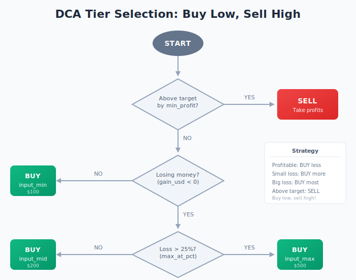
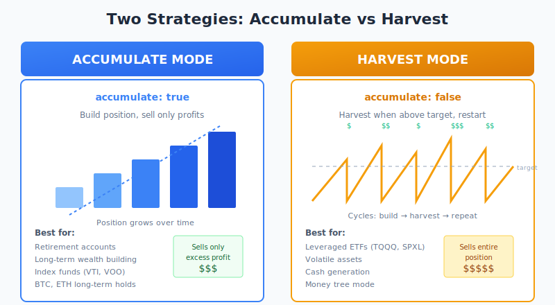

# EscapeMint Documentation

Welcome to the EscapeMint documentation. This guide explains how the rules-based investment system works.

## Why EscapeMint?

EscapeMint is a **retirement system**, not a trading platform. The name says it all: **Escape** the rat race and **Mint** your financial freedom.

**Read the [Philosophy Guide](./philosophy.md)** to understand why this system exists and what makes it different from trading apps.

## Table of Contents

1. **[Philosophy](./philosophy.md)** - Why this system exists (start here)
2. [Investment Strategy](./investment-strategy.md) - The DCA in/out methodology
3. [Fund Management](./fund-management.md) - How funds track positions and cash
4. [Configuration Guide](./configuration.md) - All configuration options explained
5. [Data Format](./data-format.md) - TSV file structure and entry types
6. [System Architecture](./architecture.md) - Package structure and data flow
7. [Derivatives](./derivatives.md) - Perpetual futures data model

## Quick Overview

EscapeMint is a **rules-based capital allocation engine** that helps you manage investments using a systematic approach:

- **Long only** - We never bet against assets; we only go long
- **Forever assets** - Only hold what survives economic catastrophe
- **Buy low, sell high** - Automatically adjusts purchase amounts based on performance
- **No emotions** - Deterministic rules remove emotional decision-making
- **Transparent** - All data stored in plain text files you can audit
- **Local-first** - Runs on your machine with no cloud dependencies

### The Core Idea

Instead of trying to time the market, EscapeMint uses a **tiered DCA (Dollar Cost Averaging)** strategy:

This creates a natural "buy low, sell high" behavior without requiring market predictions.

### Two Operating Modes

EscapeMint supports two strategies based on your goals:

- **Accumulate Mode**: Build positions you want to hold forever
- **Harvest Mode**: Turn mature positions into cash-generating "money trees"

### How It Works

1. **Set a target growth rate** (e.g., 25% APY)
2. **Configure DCA amounts** (min, mid, max)
3. **Enter snapshots** of your portfolio value
4. **Get recommendations** for BUY/SELL/HOLD actions
5. **Execute trades** and record them

The system tracks your expected value (what you'd have at target APY) vs actual value, then recommends actions to optimize returns.

## Getting Started

See the main [README.md](../README.md) for installation instructions.
